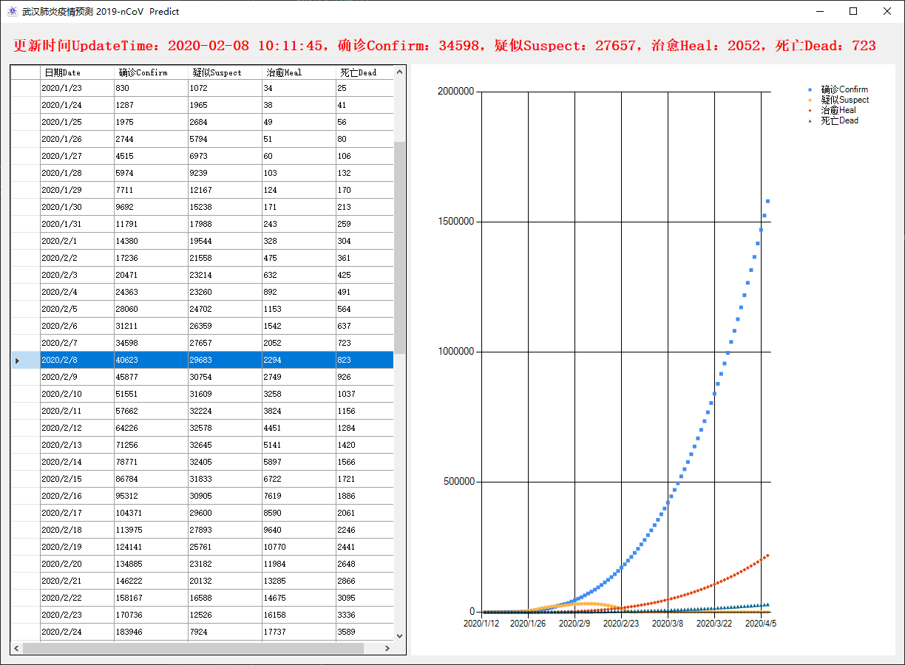

# nCoV2019_Predict

#### 介绍
武汉肺炎疫情预测

#### 软件架构
1. 用.Net开发的Windows桌面软件
2. 数据获取自腾讯 https://news.qq.com//zt2020/page/feiyan.htm
3. 通过曲线拟合预测未来疫情数据，和天气预报一样，只在短期内有一定参考意义。实际疫情肯定会在达到一定峰值后回落。

#### 安装教程

1.  无需安装，直接运行exe即可

#### 使用说明

1.  启动软件将自动获取最新数据，并基于该数据进行预测，同时绘制拟合曲线

#### 参与贡献

1.  Fork 本仓库
2.  新建 Feat_xxx 分支
3.  提交代码
4.  新建 Pull Request